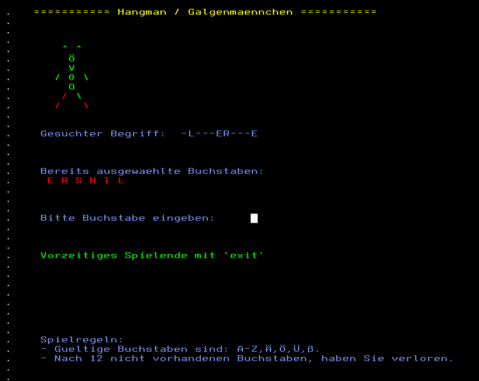

# Hangman-REXX-TSO-ISPF
Hangman Game in REXX language for TSO/ISPF on z/OS.

This game is programmed in german language, so all further information is in
German language.

# Hangman bzw. Galgenmännchen Spiel in REXX für TSO/ISPF auf z/OS

Die Programmierung dieses Spiels war eine Übungsaufgabe zum Kennenlernen von
ISPF Panels in Zusammenhang mit REXX.

Ziele:
- Galgenmännchen Spiel mit Bildschirmausgabe in einem PANEL.
- Nur eine Runde spielen, also ohne Wiederholung oder Punktestand.
- Fehleingaben sollen im ganzen Spiel abgefangen bzw. unmöglich gemacht werden.
- Möglichst wenig, dafür gut lesbarer Code (ob mir dies gelungen ist?)

Hinweise:
- Programmiert und getestet wurde der Code unter z/OS 2.5 auf einem IBM Z15.
- Die Datei HANGMAN.PANEL muss in eine Library, welche über die ISPPLIB zu finden ist
  und das Panel-Member sollte "HANGMAN" heißen. Es kann auch anders lauten, dies
  muss aber im REXX-Code angepasst werden.
- Die Datei HANGMAN.WORDS muss ebenfalls in ein Member kopiert werden. Sie enthält die 
  Ratewörter für das Spiel. Sie kann beliebig verändert und erweitert werden.
- Ob Codepage, Zeilenumbrüche etc. zu euch korrekt übertragen werden, kann ich
  nicht garantieren. Bitte bei der Übernahme kontrollieren. Am einfachsten
  wird es wohl sein, den Code per Copy&Paste über den 3270 Emulator zu 
  übertragen.
- Damit das Spiel jedoch nicht so "brutal" wirkt, habe ich auf den "Galgen" verzichtet.

